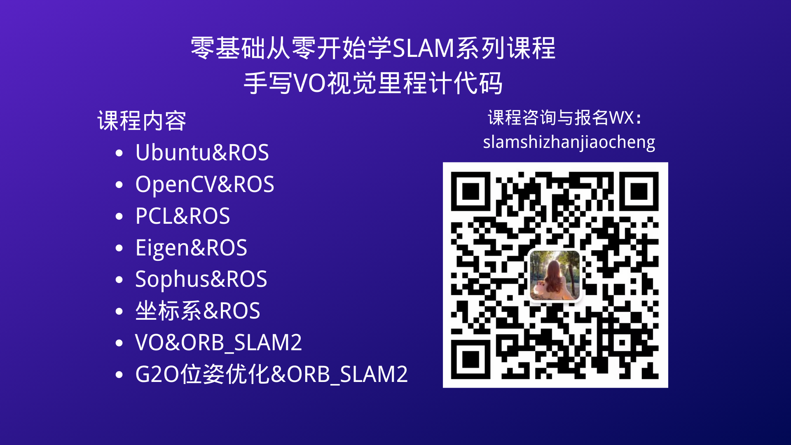

[如果不能下载代码可以关注订阅号小秋SLAM实战教程添加微信slamshizhanjiaocheng获取代码](https://mp.weixin.qq.com/s/3Z129tEr6gWKgNAoXYYk4Q)

[【开发环境】制作系统盘 安装双系统 禁用nouveau显卡 安装nvidia显卡驱动](https://chunqiushenye.blog.csdn.net/article/details/90698632)

[【开发环境】Ubuntu16.04 20.04 系统下搭建 深度学习和SLAM开发环境](https://chunqiushenye.blog.csdn.net/article/details/124454084)

[【开发环境】Ubuntu系统高频高效终端命令汇总](https://chunqiushenye.blog.csdn.net/article/details/108389642)

[【开发环境】VIM普通模式 插入模式 可视模式](https://chunqiushenye.blog.csdn.net/article/details/108411541)

[【开发环境】Ubuntu系统设置笔记本合盖不进入休眠 外接显示器不锁屏 不关闭屏幕](https://chunqiushenye.blog.csdn.net/article/details/90520548)

[【开发环境】foxit pdf阅读器 typora编辑器 flameshot截图 peek动图 Simple Screen Recorder录屏 网速显示](https://chunqiushenye.blog.csdn.net/article/details/90770604)

[【开发环境】远程可视化桌面VNC Viewer vnc4server x11vnc](https://chunqiushenye.blog.csdn.net/article/details/122022262)

[【开发环境】使用Git进行代码版本控制](https://chunqiushenye.blog.csdn.net/article/details/108745884)

[【开发环境】Clion Visual Studio Code 快捷键 插件 调试C++、ROS代码](https://chunqiushenye.blog.csdn.net/article/details/90474702)

[【C++】break continue return exit() 状态机 图灵机 结构体 枚举](https://chunqiushenye.blog.csdn.net/article/details/100155666)

[【C++】 命名空间 类 函数 变量 进程 线程](https://chunqiushenye.blog.csdn.net/article/details/103528012)

[【C++】数据结构 图的存储方式 邻接矩阵无向图深度优先搜索](https://chunqiushenye.blog.csdn.net/article/details/105296820)

[【C++】构造函数 无参构造函数 有参构造函数 拷贝构造函数内联函数](https://chunqiushenye.blog.csdn.net/article/details/109030119)

[【C++】 指向类的指针 指向类的对象 对象指针 函数指针 引用](https://chunqiushenye.blog.csdn.net/article/details/108235385)

[【C++】char uchar string stringstream queue array vector set map std::function std::bind](https://chunqiushenye.blog.csdn.net/article/details/98885199)

[【OpenCV】形成图像 模拟图像 数字图像](https://chunqiushenye.blog.csdn.net/article/details/90449301)

[【OpenCV】创建图像 像素遍历 像素显示 Vec4b Vec3b ptr at uchar](https://chunqiushenye.blog.csdn.net/article/details/114331908)

[【OpenCV】图像添加噪声 GaussianBlur medianBlur bilateralFilter](https://chunqiushenye.blog.csdn.net/article/details/114332338)

[【OpenCV】图像批量重命名](https://chunqiushenye.blog.csdn.net/article/details/114332562)

[【OpenCV】图像多通道混合addWeighted 缩放resize copyTo cvtColor](https://blog.csdn.net/qq_21950671/article/details/114332202)

[【OpenCV】图像Canny边缘检测](https://chunqiushenye.blog.csdn.net/article/details/115366504)

[【OpenCV】图像的像素直方图 图像特征点 cv::FAST cv::ORB ORB_SLAM2::ORB](https://chunqiushenye.blog.csdn.net/article/details/107092044)

[【OpenCV】图像上画线line 文字putText 椭圆ellipse 矩形框rectangle](https://chunqiushenye.blog.csdn.net/article/details/114332407)

[【OpenCV】图像去畸变](https://chunqiushenye.blog.csdn.net/article/details/114333314)

[【OpenCV】图像旋转 平移 仿射变换 透视变换](https://chunqiushenye.blog.csdn.net/article/details/114332057)

[【ROS】整体框架和组成部分功能介绍](https://chunqiushenye.blog.csdn.net/article/details/121700544)

[【ROS】创建工作空间Workspace和功能包Package](https://chunqiushenye.blog.csdn.net/article/details/121701305)

[【ROS】publish发布和subscribe订阅topic话题中的消息message](https://chunqiushenye.blog.csdn.net/article/details/108120269)

[【ROS】发布点线话题在可视化工具RVIZ显示](https://chunqiushenye.blog.csdn.net/article/details/121807790)

[【ROS】发布图形话题在可视化工具 RVIZ显示](https://chunqiushenye.blog.csdn.net/article/details/121806166)

[【ROS】创建ROS的消息msg和srv服务项目实战](https://chunqiushenye.blog.csdn.net/article/details/120861955)

[【ROS】终端常用命令汇总](https://chunqiushenye.blog.csdn.net/article/details/121702122)

[【ROS】常用可视化工具汇总](https://chunqiushenye.blog.csdn.net/article/details/112260380)

[【ROS】Launch启动文件各字段语法和例子详细讲解](https://chunqiushenye.blog.csdn.net/article/details/101703451)

[【OpenCV ROS】接收无压缩图像话题并用OpenCV可视化窗口显示](https://chunqiushenye.blog.csdn.net/article/details/121762275)

[【OpenCV ROS】读取一张图像然后发布图像话题并在rviz中显示](https://chunqiushenye.blog.csdn.net/article/details/121760654)

[【OpenCV ROS】接收压缩图像话题并显示](https://chunqiushenye.blog.csdn.net/article/details/121764362)

[【OpenCV ROS】摄像头实时发布图像话题并在rviz中显示](https://chunqiushenye.blog.csdn.net/article/details/121761895)

[【OpenCV ROS】读取视频然后发布图像话题并在rviz中显示](https://blog.csdn.net/qq_21950671/article/details/121761622)

[【OpenCV ROS】 接收压缩图像话题并显示](https://blog.csdn.net/qq_21950671/article/details/121764362)

[【OpenCV ROS】读取一张图像然后发布图像话题并在rviz中显示](https://blog.csdn.net/qq_21950671/article/details/121760654)

[【OpenCV ROS】摄像头实时发布图像话题并在rviz中显示](https://blog.csdn.net/qq_21950671/article/details/121761895)

[【Point Cloud ROS】点云数据类型、公共字段、ROS的PCL接口](https://chunqiushenye.blog.csdn.net/article/details/121673843)

[【从零开始学习SLAM】Ubuntu 20.04 slambook slambook2 代码运行环境搭建](https://chunqiushenye.blog.csdn.net/article/details/124288899)

[【从零开始学习SLAM】VIZ Pangolin 可视化](https://chunqiushenye.blog.csdn.net/article/details/106080787)

[【从零开始学习SLAM】坐标变换 Eigen Sophus 旋转矩阵 轴角 旋转向量 欧拉角 四元数 位姿变换](https://chunqiushenye.blog.csdn.net/article/details/100080945)

[【从零开始学习SLAM】坐标变换 像素坐标系 图像坐标系 相机坐标系 相机归一化坐标系 世界坐标系](https://chunqiushenye.blog.csdn.net/article/details/109520451)

[【ROS tf】坐标变换](https://chunqiushenye.blog.csdn.net/article/details/109240832)

[【ROS tf】小海龟眼睛坐标系下的点转换到另一只小海龟眼睛坐标系下](https://chunqiushenye.blog.csdn.net/article/details/121949241)

[【ROS tf】官方tf教程小海龟跟随程序原理解读](https://chunqiushenye.blog.csdn.net/article/details/121826213)

[【ROS tf】ROS话题tf、tf_static、urdf模型、static_transform_publisher功能包之间的关系](https://chunqiushenye.blog.csdn.net/article/details/121835124)

[【ROS tf2】获取两只小海龟之间的位姿变换](https://chunqiushenye.blog.csdn.net/article/details/122212412)

[【ROS tf2】通过实时获取小海龟的位姿发布它相对世界坐标系的坐标](https://chunqiushenye.blog.csdn.net/article/details/122210020)

[【ROS tf2】发布静态坐标系](https://chunqiushenye.blog.csdn.net/article/details/122198641)

[【从零开始学习SLAM】2D-2D 两张图像匹配的特征点求解位置姿态](https://blog.csdn.net/qq_21950671/article/details/105731352)

[【Point Cloud ROS】用一张彩色图像和深度图像生成点云图像](https://chunqiushenye.blog.csdn.net/article/details/121678165)

[【Point Cloud ROS】两张点云图像之间的位姿变换](https://chunqiushenye.blog.csdn.net/article/details/121694704)

[【从零开始学习SLAM】三角化方法求3D空间点的深度](https://blog.csdn.net/qq_21950671/article/details/105732710)

[【从零开始学习SLAM】两帧之间的视觉里程计并用g2o优化](https://blog.csdn.net/qq_21950671/article/details/105943845)

[【从零开始学习SLAM】曲线拟合项目实战教程G2O图优化 雅可比矩阵推导](https://blog.csdn.net/qq_21950671/article/details/105843736)

[【从零开始学习SLAM】3D空间点和2D特征点求位姿并用高斯牛顿和G2O优化](https://blog.csdn.net/qq_21950671/article/details/105790016)

[【从零开始学习SLAM】两张图像如何拼接成点云](https://blog.csdn.net/qq_21950671/article/details/105654460)

[【Point Cloud ROS】对点云进行位姿态变换](https://chunqiushenye.blog.csdn.net/article/details/121773405)

[【从零开始学习SLAM】BA问题用g2o求解重新投影误差优化相机位姿和路标点](https://blog.csdn.net/qq_21950671/article/details/106195215)

[【从零开始学习SLAM】匹配的3D空间点对应用矩阵分解求位姿并用g2o优化](https://blog.csdn.net/qq_21950671/article/details/106403056)

[【从零开始学习SLAM】LDSO运行测试](https://chunqiushenye.blog.csdn.net/article/details/112988252)

[【从零开始学习SLAM】编译运行MultiCol-SLAM(multi-fisheye camera SLAM system)](https://chunqiushenye.blog.csdn.net/article/details/90289526)

[【从零开始学习SLAM】MCPTAM MultiCol-SLAM 安装以及两者相机标定文件参数之间的转换](https://chunqiushenye.blog.csdn.net/article/details/100070815)

[【从零开始学习SLAM】机器人仿真 导航仿真](https://chunqiushenye.blog.csdn.net/article/details/103787016)

[【从零开始学习SLAM】扫地机器人工作原理 传感器原理 结构 工作流程 路径规划技术](https://chunqiushenye.blog.csdn.net/article/details/105158308)

[【从零开始学习SLAM】TurtleBot3硬件结构 多机通信 地图生成和保存 键盘控制 在RVIZ中显示 导航](https://chunqiushenye.blog.csdn.net/article/details/108370123)

[【从零开始学习SLAM】ros navigation AMCL move_base配置文件 A-Star Dijkstra 算法原理](https://chunqiushenye.blog.csdn.net/article/details/120953944)

[【ORB_SLAM2源码解读】Ubuntu 20.04编译跑通ORB_SLAM2、ORB_SLAM3](https://chunqiushenye.blog.csdn.net/article/details/124143889)

[【ORB_SLAM3源码解读】Ubuntu 16.04 编译跑通 ORB_SLAM3 各个版本](https://chunqiushenye.blog.csdn.net/article/details/107579138)

[【ORB_SLAM2源码解读】针孔鱼眼相机camera和惯导IMU标定方法汇总以及详细标定过程](https://chunqiushenye.blog.csdn.net/article/details/109743778)

[【ORB_SLAM2源码解读】从文件或终端读写yaml和txt文件](https://chunqiushenye.blog.csdn.net/article/details/108703089)

[【ORB_SLAM2源码解读】TUM数据集RGBD-Benchmark associate.py evaluate_ate.py evaluate_rpe.py](https://chunqiushenye.blog.csdn.net/article/details/109143447)

[【ORB_SLAM2源码解读】evo工具评估位姿轨迹精度](https://chunqiushenye.blog.csdn.net/article/details/107068143)

[【ORB-SLAM2源码解读】论文公式](https://chunqiushenye.blog.csdn.net/article/details/107783232)

[【ORB_SLAM2源码解读】TUM、EuRoC单目数据集跑通ORB_SLAM2](https://chunqiushenye.blog.csdn.net/article/details/124116409)

[【ORB_SLAM2源码解读】EuRoC双目数据集跑通ORB_SLAM2](https://chunqiushenye.blog.csdn.net/article/details/124048575)

[【ORB_SLAM2源码解读】TUM RGBD 数据集跑通ORB_SLAM2](https://chunqiushenye.blog.csdn.net/article/details/124105206)

[【ORB_SLAM2源码解读】Intel RealSense Depth Camera D435i 实时跑ORB_SLAM2单目 双目 RGBD](https://chunqiushenye.blog.csdn.net/article/details/107042281)

[【ORB_SLAM2源码解读】Intel RealSense Depth Camera D435i 双目 RGBD 小觅双目 自制双目 跑通 ORB_SLAM2 RTAB-Map](https://blog.csdn.net/qq_21950671/article/details/99694800)

[【ORB_SLAM2源码解读】Intel RealSense Depth Camera D455跑通 orb_slam2_ros](https://blog.csdn.net/qq_21950671/article/details/122541536)

[【ORB_SLAM2源码解读】Intel RealSense Depth Camera D435i 跑通 RTAB-Map](https://chunqiushenye.blog.csdn.net/article/details/104147297)

[【逐函数讲解ORB_SLAM2源码】1.加载Euroc数据集图像](https://chunqiushenye.blog.csdn.net/article/details/124048827)

[【逐函数讲解ORB_SLAM2源码】2.图像去畸变](https://chunqiushenye.blog.csdn.net/article/details/124048911)

[【逐函数讲解ORB_SLAM2源码】3.ORB_SLAM2系统初始化](https://chunqiushenye.blog.csdn.net/article/details/124105723)

[【逐函数讲解ORB_SLAM2源码】4.计算umax](https://chunqiushenye.blog.csdn.net/article/details/124049114)

[【逐函数讲解ORB_SLAM2源码】5.图像金字塔](https://chunqiushenye.blog.csdn.net/article/details/124049147)

[【逐函数讲解ORB_SLAM2源码】6.图像金字塔提取特征点](https://chunqiushenye.blog.csdn.net/article/details/124103880)

[【逐函数讲解ORB_SLAM2源码】7.四叉树初始节点](https://chunqiushenye.blog.csdn.net/article/details/124104114)

[【逐函数讲解ORB_SLAM2源码】8.四叉树节点分裂](https://chunqiushenye.blog.csdn.net/article/details/124104359)

[【逐函数讲解ORB_SLAM2源码】9.四叉树实现特征点均匀化](https://chunqiushenye.blog.csdn.net/article/details/124104510)

[【逐函数讲解ORB_SLAM2源码】10.特征点的几何中心和灰度质心](https://blog.csdn.net/qq_21950671/article/details/124104681)

[【逐函数讲解ORB_SLAM2源码】11.具有旋转不变性的描述子](https://blog.csdn.net/qq_21950671/article/details/124104990)

[【ORB_SLAM2源码解读】分析ORB_SLAM2 RGBD 第0帧是怎么计算位置姿态的](https://blog.csdn.net/qq_21950671/article/details/124175504)

[【ORB_SLAM2源码解读】分析ORB_SLAM2 RGBD 第1帧是怎么计算位置姿态的](https://blog.csdn.net/qq_21950671/article/details/124323131)

[【ORB_SLAM2源码解读】LocalMapping线程执行流程](https://blog.csdn.net/qq_21950671/article/details/120311881)

[【ORB_SLAM2源码解读】ORB_SLAM2::LoopClosing::Run](https://chunqiushenye.blog.csdn.net/article/details/120434794)

[【ORB_SLAM2源码解读】MapPoint SetWorldPos、GetWorldPos、GetNormal、mNormalVector](https://blog.csdn.net/qq_21950671/article/details/124105839)

[【ORB_SLAM2源码解读】System::TrackRGBD Tracking::GrabImageRGBD Frame::Frame Track](https://blog.csdn.net/qq_21950671/article/details/124049015)

[「ORB_SLAM2源码解读」之函数ORBmatcher::SearchForInitialization()](https://chunqiushenye.blog.csdn.net/article/details/111624223)

[【ORB_SLAM2源码解读】rgbd_tum 生成世界坐标系下的三维点完成双目和RGBD初始化操作 Tracking::StereoInitialization()](https://chunqiushenye.blog.csdn.net/article/details/124117962)

[【ORB_SLAM3源码解读】IMU基础介绍、IMU姿态、速度、位置解算以及误差方程、坐标系](https://chunqiushenye.blog.csdn.net/article/details/124488411)

[【ORB_SLAM3源码解读】手撕IMU预积分公式](https://chunqiushenye.blog.csdn.net/article/details/123893300)

[【ORB_SLAM3源码解读】原理解读代码实战教程](https://chunqiushenye.blog.csdn.net/article/details/123814199)

